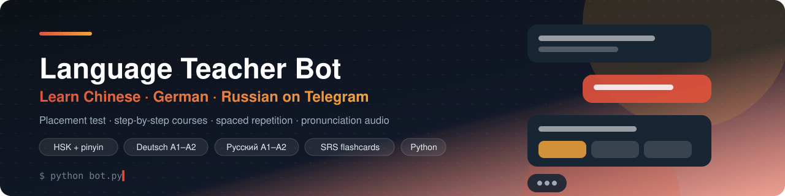
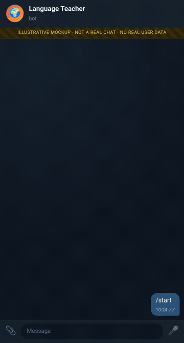
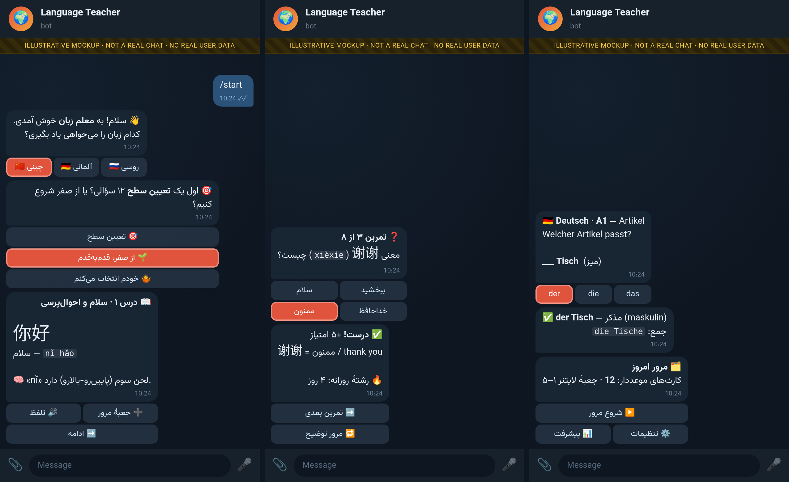

<!-- readme-top -->
<div align="center">



# Language Teacher Bot — Learn Chinese, German & Russian on Telegram

[](LICENSE)   [](https://github.com/reza-em/language-teacher-bot-chinese-german-russian/stargazers)

> Telegram language-learning bot for Chinese (HSK, pinyin), German and Russian with placement test, spaced repetition, grammar, pronunciation audio and exercises. Persian (Farsi) UI.

**[فارسی](#-فارسی) · [English](#-english) · [Русский](#-русский) · [Deutsch](#-deutsch)**

⭐ **If this project is useful to you, please give it a star** — it helps other people find it. [**Star on GitHub**](https://github.com/reza-em/language-teacher-bot-chinese-german-russian/stargazers) · 🍴 [Fork](https://github.com/reza-em/language-teacher-bot-chinese-german-russian/fork) · 🐛 [Issues](https://github.com/reza-em/language-teacher-bot-chinese-german-russian/issues)

</div>

## ✨ Highlights

- 🎯 **Placement test** (12 questions) and a guided course from zero
- 🇨🇳 **Chinese**: 156-lesson course, HSK 1–3 vocabulary, pinyin & tones, stroke order images
- 🇩🇪 **German** (79 lessons) and 🇷🇺 **Russian** (81 lessons) at A1–A2, with their own grammar, alphabet and pronunciation notes
- 🗂 **Spaced repetition** flashcards (Leitner 1–5 or SM-2) and 17 exercise types with instant correction
- 🔊 Pronunciation audio (TTS), offline dictionary built from open datasets
- 👥 **Group mode**: quizzes, word of the day, leaderboard and an optional gentle "teacher" mode
- 📝 Honest limits: German/Russian content is AI-assisted and not yet reviewed by native speakers (see License section)

## 🎬 Demo

<div align="center">

</div>

<div align="center">

</div>

> 🖼 **These are illustrative mockups**, rendered locally from scripted conversations (see [`docs/mockups`](docs/mockups)). They are not real chats and contain no real user data; names, numbers and links are examples.

## 🚀 Quick start

```bash
git clone https://github.com/reza-em/language-teacher-bot-chinese-german-russian.git && cd language-teacher-bot-chinese-german-russian
python3 -m venv venv && ./venv/bin/pip install -r requirements.txt
python3 build_data.py                        # downloads open datasets, builds data/dict.sqlite
export CHINESE_TELEGRAM_BOT_TOKEN=...        # from @BotFather
export OWNER_ID=123456789 OWNER_USERNAME=your_username
./run.sh
./venv/bin/python test_offline.py
```

More options, admin panel and platform notes are in the sections below. Tokens are read only from environment variables — never commit them.

---

## 🌐 فارسی

ربات تلگرام **آموزش زبان چینی، آلمانی و روسی** برای فارسی‌زبان‌ها: تعیین سطح، درس‌های مرحله‌به‌مرحله (از صفر تا A2)، تلفظ و صدا، گرامر، جمله، فلش‌کارت مرور با تکرار فاصله‌دار، تمرین با تصحیح، پیشرفت جداگانه برای هر زبان و پشتیبانی از گروه. شامل HSK و پین‌یین برای چینی.

**کلیدواژه‌ها:** آموزش زبان چینی، آموزش آلمانی، آموزش روسی، ربات آموزش زبان تلگرام، یادگیری زبان، HSK، پین‌یین، فلش کارت، معلم زبان

## 🇬🇧 English

A Telegram **language-teacher bot for Chinese (HSK, pinyin), German and Russian** with Persian (Farsi) explanations: placement test, lesson courses from zero to A2, pronunciation audio, grammar, example sentences, spaced-repetition flashcards, exercises with correction, per-language progress and group mode. Offline dictionary built from open datasets.

**Keywords:** learn Chinese Telegram bot, learn German bot, learn Russian bot, language learning bot, HSK vocabulary, pinyin trainer, spaced repetition flashcards, Persian speakers

## 🇷🇺 Русский

Telegram-бот **для изучения китайского (HSK, пиньинь), немецкого и русского языков** с объяснениями на персидском: тест уровня, курс от нуля до A2, произношение с аудио, грамматика, примеры, карточки с интервальным повторением, упражнения с проверкой. Режим для групп.

**Ключевые слова:** изучение китайского языка, изучение немецкого, русский язык для персов, бот для изучения языков Telegram, HSK, пиньинь, карточки

## 🇩🇪 Deutsch

Telegram-**Sprachlehrer-Bot für Chinesisch (HSK, Pinyin), Deutsch und Russisch** mit persischen Erklärungen: Einstufungstest, Kurse von null bis A2, Aussprache mit Audio, Grammatik, Beispielsätze, Karteikarten mit Spaced Repetition, Übungen mit Korrektur, Gruppenmodus.

**Stichwörter:** Chinesisch lernen Bot, Deutsch lernen Telegram, Russisch lernen, Sprachlern-Bot, HSK Vokabeln, Pinyin, Karteikarten

---

## Features

- Placement test (12 questions) and per-language level/course
- Chinese: HSK vocabulary, pinyin, tones, stroke images; German: 79 lessons; Russian: 81 lessons (A1-A2)
- Spaced-repetition review cards (SRS), exercises with correction, TTS audio
- Group mode: admin selects the group language
- Offline dictionary rebuilt from open datasets (`build_data.py`)
- Offline tests

## Setup

```bash
python3 -m venv venv && ./venv/bin/pip install -r requirements.txt
python3 build_data.py            # downloads open datasets, builds data/dict.sqlite (not shipped)
export CHINESE_TELEGRAM_BOT_TOKEN=...   # from @BotFather
export OWNER_ID=123456789 OWNER_USERNAME=your_username
./run.sh
./venv/bin/python test_offline.py   # dictionary tests need build_data.py first
```

> **Configuration note:** the owner/admin identity is read from environment variables (`OWNER_ID`, `OWNER_USERNAME`, `SUPPORT_USERNAME`) with the placeholder `example_owner`. Set them to your own values before running. Never commit bot tokens — they are read only from the environment.

## Usage

Open your bot in the messenger and send `/start`. See the detailed documentation below for commands, admin panel and platform-specific notes.

## License

Code: [MIT License](LICENSE). Bundled derived data (`data/hsk13.json`, `data/sentences.json`, `data/src/`) comes from open datasets (CC-CEDICT CC BY-SA 4.0, Tatoeba CC BY 2.0 FR, complete-HSK-vocabulary, HanDeDict); see `NOTICE`. Persian translations, German/Russian vocabulary and grammar were AI-assisted and have **not** been reviewed by native speakers.

---

## Detailed documentation

# معلم زبان | Language Teacher — ربات تلگرام (چینی · آلمانی · روسی)

ربات آموزش زبان برای فارسی‌زبان‌ها: **چینی (ماندارین)، آلمانی، روسی**؛ رابط و توضیحات: **فارسی / English / Deutsch** (انتخابی یا تشخیص خودکار).
پایتون، `getUpdates` (long polling)، SQLite، یک پردازش (قفل `bot.lock`).

## 🌍 چندزبانه (جدید): چینی · آلمانی · روسی
> English summary: the bot started as a Chinese-only teacher and is now a multi-language teacher. Chinese is unchanged; **German (A1–A2)** and **Russian (A1–A2)** were added with their own curated vocabulary, alphabet/pronunciation notes, grammar notes, sentences, exercises, guided course, placement test, TTS and dictionary. The bot username was **not** changed.

- **انتخاب زبان:** در `/start` (بعد از زبان رابط) زبان هدف را انتخاب می‌کنی (🇨🇳 / 🇩🇪 / 🇷🇺). هر زمان با `/lang` یا دکمهٔ 🌍 منو زبان را عوض می‌کنی یا زبان تازه‌ای اضافه می‌کنی؛ چند زبان را هم‌زمان می‌شود خواند.
- **پیشرفت جدا برای هر زبان:** کارت‌های مرور (لایتنر ۱–۵ یا SM-2)، سطح، دورهٔ قدم‌به‌قدم و نتیجهٔ تعیین‌سطح برای هر زبان جداگانه ذخیره می‌شود؛ با برگشت به یک زبان همان‌جا که مانده‌ای ادامه می‌دهی. آمار کلی (امتیاز، رشتهٔ روزانه) مشترک است. یادآوری روزانه تعداد کارت‌های موعددار همهٔ زبان‌ها را جمع می‌زند و دورهٔ ناتمام هر زبان را یادآوری می‌کند.
- **آلمانی:** دورهٔ ۷۹ درسی: ماژول آواها (۹ قاعده: اومالوت ä ö ü، ß/ss، دو تلفظ ch، sch/sp/st، ei/ie/eu، w/v/z/j، r و -er، مصوت کوتاه/بلند، بی‌واک‌شدن همخوان پایانی)، سپس واژگان A1 و A2، دستور (۱۱ یادداشت: حرف تعریف و جنسیت der/die/das، جمع، حال ساده، ترتیب جمله V2، حالت‌ها Nom/Akk/Dat، منفی kein/nicht، فعل‌های کمکی، فعل‌های جداشدنی، Perfekt، حرف اضافه، زمان)، جمله‌ها و آزمون‌های مرحله‌ای. تمرین‌ها: حرف تعریف، جمع، صرف فعل، حالت، جای‌خالی، جمله‌سازی، تایپ با تصحیح (اومالوت/ß: «Strasse» و «Tuer» پذیرفته می‌شود ولی تذکر می‌گیرد؛ حرف تعریف اشتباه جدا گفته می‌شود).
- **روسی:** دورهٔ ۸۱ درسی: الفبای سیریلیک (۳۳ حرف در ۶ درس) و ۶ قاعدهٔ تلفظ (مصوت‌های سخت/نرم، ь و ъ، تکیه و کاهش مصوت، بی‌واک‌شدن پایانی، ж ш ц / ч щ й، ё)، سپس واژگان A1 و A2، دستور (۱۲ یادداشت: جنسیت، быть، جمع، حال، گذشته، حالت‌ها: مفعولی/حالت جار/اضافی + نمای کلی، **افعال حرکت идти/ходить و ехать/ездить در حد مبتدی**، دید فعل در حد آشنایی، جمله‌های پرسشی)، جمله‌ها و آزمون‌ها. واژه‌ها با نشانهٔ تکیه و آوانگاری لاتین نشان داده می‌شوند؛ تمرین‌های تکیه، جنسیت، جمع، صرف، حالت، خواندن سیریلیک و تایپ (ё/е و علامت تکیه نادیده؛ تایپ لاتین پیام «کیبورد روسی را فعال کن» می‌گیرد).
- **از صفر + تعیین سطح:** همان موتور دورهٔ چینی برای هر زبان (۱۲ سؤال تعیین‌سطح: ۴ سؤال در هر پلهٔ مبتدی/A1/A2 → پیشنهاد درس شروع). درس‌ها: صفحه‌های آموزشی ← تمرین با اصلاح ← قبولی ≥ ۷۰٪ ← واژه‌ها خودکار وارد جعبهٔ مرور می‌شوند.
- **صوت (TTS):** edge-tts با صدای `de-DE-KatjaNeural` و `ru-RU-SvetlanaNeural` (سرویس آنلاین؛ تکیه برای صدا حذف می‌شود؛ کش دیسکی). زبان صدا از خود متن (هانزی/سیریلیک) یا زبان هدف چت تشخیص داده می‌شود.
- **دیکشنری آلمانی/روسی:** فقط روی فهرست دست‌چین A1–A2 همین پروژه (آلمانی/روسی/فارسی/انگلیسی، و لاتین‌نویسی روسی مثل `privet`)؛ **دیکشنری کامل نیست** و بیرون از فهرست «پیدا نشد» می‌گوید (یا با LLM اگر تنظیم باشد). `/ask` بدون LLM از یادداشت‌های دستوری و دیکشنری جواب می‌دهد.
- **گروه:** ادمین در `/settings` زبان هدف گروه را انتخاب می‌کند (پیش‌فرض چینی). `/quiz` (برای آلمانی/روسی: ترجمه، جای‌خالی، شنیداری)، `/word`، `/dict`، `/ask`، «واژهٔ روز» و سطح (A1/A2) از زبان هدف گروه پیروی می‌کنند.
- **جزئیات فنی:** شناسهٔ واژه‌ها: چینی `< 1,000,000`، آلمانی از `1,000,000`، روسی از `2,000,000` — **فایل‌های `content/de_words.py` و `content/ru_words.py` فقط باید «به انتها اضافه» شوند** (کارت‌های مرور شناسه را ذخیره می‌کنند). جدول `course` به کلید (کاربر، زبان) مهاجرت می‌کند (خودکار؛ روی کپی DB واقعی آزمایش شد)؛ ستون‌های `users.target/tlangs`، `chats.target` و جدول `ulang` اضافه شده است. ماژول‌ها: `langs.py` (رجیستری و بارگذار)، `xlang.py` (تمرین‌ها و تصحیح)، `curriculum_x.py` + `lesson_content_x.py` (دوره)، `uix.py` (منوی زبان/الفبا/دیکشنری)، `xtexts.py` (متن‌ها).
- **آواتار:** `make_avatar_lang.py` تصویر `assets/avatar_lang.png` (حباب‌های گفتگو با 中 A Я ä) و `assets/logo.png` (تصویر خوشامد) را می‌سازد؛ `setup_profile.py` همان را روی ربات می‌گذارد. نام‌کاربری ربات تغییر نمی‌کند.

### مجوز و صداقت دربارهٔ محتوای آلمانی و روسی
| محتوا | منبع / مجوز |
|---|---|
| فهرست واژگان A1–A2 آلمانی (۳۰۲ واژه) و روسی (۲۷۹ واژه) | **دست‌چین‌شده و نوشتهٔ خود پروژه (با کمک هوش مصنوعی)**؛ از فهرست‌های Goethe-Institut/ÖSD/TORFL یا هیچ دیکشنری کپی نشده است. سطح‌ها (A1/A2) **تقریبی**اند، نه فهرست رسمی |
| معنی‌های فارسی و انگلیسی، آوانگاری لاتین، تکیه، جنسیت/جمع | نوشتهٔ خود پروژه — **بازبینی‌نشده توسط گویشور بومی یا مترجم حرفه‌ای**؛ ممکن است اشتباه، معنی ناکامل یا تکیهٔ نادرست داشته باشد |
| جمله‌های نمونه (آلمانی ۵۲، روسی ۴۵)، یادداشت‌های دستور و آوا (آلمانی ۱۱+۹، روسی ۱۲+۶)، الفبای روسی، تمرین‌های ثابت (۱۴ تا برای هر زبان) | نوشتهٔ خود پروژه، همین هشدار را دارند؛ تمرین‌های دیگر برنامه‌ای از همین فهرست‌ها ساخته می‌شوند |
| توضیحات آلمانی رابط برای رشته‌های جدید | بیشترِ آن‌ها فعلاً به انگلیسی برمی‌گردد (فقط بخشی ترجمه شده) |
| صوت | edge-tts (مثل چینی؛ مجوز باز ندارد) |
مجوز دادهٔ چینی مثل جدول بالا باقی می‌ماند. چون هیچ دادهٔ بیرونی برای آلمانی/روسی استفاده نشده، تعهد انتساب خاصی نیست؛ اگر بعداً فهرست آزاد (مثلاً Wiktionary/Tatoeba) اضافه شود باید مجوزش اینجا ثبت شود. **اگر برای آموزش جدی استفاده می‌کنی، معنی‌ها را با یک گویشور بررسی کن.**

### محدودیت‌های چندزبانگی
- حالت معلم گروه، داستان‌های کوتاه، خواندن/تکرار صوتی (shadowing)، ریشه‌ها/ترتیب خط و پین‌یین **فقط چینی**‌اند؛ برای آلمانی/روسی غیرفعال یا پنهان‌اند (پیام «فقط برای چینی»).
- دیکشنری آلمانی/روسی فقط فهرست دست‌چین است؛ آزمون «شبیه‌ساز» برای این‌ها تقریبی و بر پایهٔ همین فهرست است (نه CEFR رسمی).
- کانال‌ها (`channels.py`، کیت کانال) همچنان فقط چینی‌اند.
- فقط A1–A2؛ سطح B1 به بعد نداریم. بانک تمرین‌های ثابت کوچک است (۱۴ تا برای هر زبان) و بقیه برنامه‌ای‌اند.
- عملکرد واقعی در تلگرام (UI جدید، صوت در جریان واقعی، آپلود آواتار) فقط با آزمون‌های شبیه‌سازی‌شده بررسی شده و باید به‌صورت دستی تست شود.

## اجرا
```bash
cd chinese-bot
python3 -m venv venv && ./venv/bin/pip install -r requirements.txt
./venv/bin/python build_data.py          # دیتاست‌ها را می‌گیرد و data/ را می‌سازد (حدود ۶۶ مگابایت dict.sqlite؛ در zip نیست)
export CHINESE_TELEGRAM_BOT_TOKEN='<توکن BotFather>'   # نام متغیر برای سازگاری حفظ شد
./venv/bin/python setup_profile.py       # نام، توضیحات، دستورها (با scope و زبان)، عکس پروفایل
./run.sh                                 # اجرای جداشده با راه‌اندازی مجدد خودکار؛ ./stop.sh برای توقف
./venv/bin/python test_offline.py        # آزمون‌ها (تلگرام شبیه‌سازی‌شده، بدون شبکه/توکن)
```
توکن فقط از متغیر محیطی خوانده می‌شود و هرگز لاگ/چاپ نمی‌شود.

## امکانات
- **برنامهٔ درسی:** پین‌یین (آغازه‌ها، پایانه‌ها، لحن‌ها، قاعدهٔ نشانهٔ لحن، تغییر لحن)، ریشه‌ها و ترتیب خط (تصویر محلی از داده‌های Make Me a Hanzi)، لغات HSK ۱–۳ (۵۹۵ واژه، با مثال)، ۱۹ نکتهٔ دستوری، ۱۶ ضرب‌المثل، فرهنگ، ۶ داستان کوتاه با کلید پین‌یین/ترجمه.
- **دیکشنری:** ورودی چینی، پین‌یین (با/بی‌لحن)، فارسی، انگلیسی، آلمانی؛ تلفظ صوتی؛ تفکیک جملهٔ چینی به واژه‌ها.
- **معلم:** `/today /learn /quiz /review /dict /ask /alphabet /read /progress /settings /stroke`؛ ۱۷ نوع تمرین با اصلاح و توضیح فارسی؛ جعبهٔ لایتنر ۱ تا ۵ (۱/۲/۴/۸/۱۶ روز؛ پاسخ غلط → جعبهٔ ۱) یا SM-2؛ رشتهٔ روزانه؛ مرور اشتباه‌ها؛ آزمون ۱۰سؤالی HSK.
- **روش‌های قابل‌انتخاب (۱۳):** فلش‌کارت، یادیار، ریشه‌ها، نوشتن/ترتیب خط، دیکته، تایپ پین‌یین، جمله‌سازی، تکرار پس از شنیدن (ویس)، جای‌خالی، تطبیق، مرور روزانه، آزمون HSK، داستان.
- **گروه‌ها:** `/quiz /word /dict /ask /top /settings` + منشن و ریپلای؛ آزمون گروهی (اولین پاسخ درست امتیاز می‌گیرد، هر نفر یک بار)؛ جدول رتبه؛ تنظیمات فقط برای ادمین‌های گروه؛ محدودیت نرخ؛ پیشرفت خصوصی و گروهی جداست (لینک «باز کردن گفتگوی خصوصی»). ربات در خصوصی هم کامل جواب می‌دهد. هنگام افزودن به گروه معرفی کامل و هنگام ادمین‌شدن پیام تشکر می‌فرستد.
- **حالت معلم در گروه (Teacher mode):** وقتی حریم خصوصی (privacy mode) خاموش است یا ربات ادمین است، پیام‌های مربوط به چینی را می‌خواند و مثل یک معلم صبور و مهربان جواب می‌دهد: پاسخ به پرسش‌ها، **اصلاح ملایم جملهٔ چینی** (جملهٔ درست + پین‌یین + توضیح کوتاه به زبان گروه fa/en/de)، تحسین پاسخ درست، دلگرمی، سؤال پیگیری و **تمرین کوچک** (دکمهٔ «🧠 تمرین کوچک»؛ جواب را روی پیام ریپلای کنید، پاسخ درست ۵ امتیاز در جدول گروه دارد). به ریپلای روی پیام‌های خودش هم جواب می‌دهد (با زمینهٔ گفتگو). ادمین‌های گروه در `/settings` ← «🎓 حالت معلم» یکی از **همیشه / فقط با منشن یا ریپلای / خاموش** را انتخاب می‌کنند (پیش‌فرض: همیشه، فقط برای پیام‌های شبیه چینی/پرسش یادگیری).
  - **ضد اسپم:** پاسخ‌های بدون فراخوانی: حداقل ۹۰ ثانیه فاصله در هر گروه، ۵ دقیقه برای هر عضو، حداکثر ۱۰ در ساعت؛ پیام‌های فوروارد‌شده، لینک‌دار، طولانی (>۴۰۰ نویسه)، ریپلای به دیگر اعضا و گفتگوی غیرمرتبط (مثلاً «ظرف چینی») نادیده گرفته می‌شود. پاسخ به منشن/ریپلای/دستور با محدودیت نرخ جدا.
  - **با LLM** (در صورت تنظیم): پاسخ با شخصیت معلم، سقف روزانهٔ هر عضو و هر گروه (۸۰). **بدون LLM:** بررسی چند الگوی رایج خطا (مثل 是很، 没…了، 不有، کلمهٔ پرسشی + 吗، حذف کلمهٔ شمارش 个)، پین‌یین و معنی واژه‌ها از دیکشنری، پاسخ قاعده‌محور به پرسش‌های دستوری — و صادقانه می‌گوید که ترجمهٔ کامل جمله و پیدا کردن همهٔ خطاها بدون هوش مصنوعی ممکن نیست.
  - پیشرفت خصوصی کاربران کاملاً مستقل از گروه است.
- **پنل مالک** (`/admin`): آمار، کاربران، گروه‌ها، پیام همگانی با تنظیم سرعت (۲۰ پیام/ثانیه)، ویرایش محتوا (واژه/درس/تمرین)، تنظیم LLM، خروجی zip، کیت کانال.
- **کانال:** `channel_kit.md`.

## زمان‌بندی (پیش‌فرض‌ها)
| مورد | پیش‌فرض |
|---|---|
| یادآوری روزانهٔ کاربر | **غیرفعال (opt-in)**؛ پیشنهاد ۲۰:۰۰؛ منطقهٔ زمانی پیش‌فرض Asia/Tehran (قابل تغییر در تنظیمات)؛ روزی یک بار؛ اگر هدف روز انجام شده باشد نمی‌فرستد؛ اگر ربات خاموش بود بیش از ۳ ساعت دیرتر نمی‌فرستد |
| واژهٔ روز گروه | خاموش تا ادمین گروه در `/settings` روشن کند؛ پیش‌فرض ۰۹:۰۰ |
| حالت معلم گروه | همیشه (فقط پیام‌های مربوط به چینی، با فاصله‌های بالا)؛ تغییر توسط ادمین گروه |
| پست کانال | بعد از ثبت کانال: ۰۹:۰۰ ۱۳:۰۰ ۱۸:۰۰ ۲۱:۰۰ (تهران)، هفت نوع محتوا به‌صورت چرخشی |

## هوش مصنوعی (اختیاری)
بدون کلید، `/ask` با قواعد و دیکشنری جواب می‌دهد (و صادقانه می‌گوید). برای فعال‌سازی:
```bash
export CHINESE_LLM_API_KEY=...            # هر سرویس سازگار با OpenAI
export CHINESE_LLM_BASE_URL=https://api.openai.com/v1   # اختیاری
export CHINESE_LLM_MODEL=gpt-4o-mini                    # اختیاری
export CHINESE_LLM_STT_MODEL=whisper-1                  # اختیاری: بررسی تلفظ از روی ویس
```
با کلید: پاسخ `/ask`، تصحیح ترجمهٔ آزاد، معنی فارسی/آلمانی برای واژه‌های خارج از HSK (کش‌شده)، بررسی ویس (با STT). سقف روزانهٔ هر کاربر (۲۰) از پنل مالک تغییر می‌کند. کلید هرگز ذخیره یا نمایش داده نمی‌شود.

## دادهٔ استفاده‌شده و مجوزها
| داده | مجوز |
|---|---|
| CC-CEDICT (MDBG) | CC BY-SA 4.0 |
| complete-hsk-vocabulary (drkameleon) — فهرست HSK | MIT |
| HanDeDict (معنی آلمانی) | CC BY-SA 3.0 (طبق سرفایل؛ README آن ۲.۰ ذکر کرده) |
| Make Me a Hanzi — `dictionary.txt` | LGPL-3 |
| Make Me a Hanzi — `graphics.txt` (ترتیب خط) | Arphic Public License |
| Tatoeba (جمله‌های نمونه) | CC BY 2.0 FR — با ذکر منبع |
| pypinyin | MIT |
| تلفظ صوتی | edge-tts (سرویس آنلاین Microsoft Edge؛ مجوز باز ندارد و ممکن است تغییر کند) — با کش دیسکی |
| معنی‌های فارسی ۵۹۵ واژه، متن‌های آموزشی، ضرب‌المثل‌ها، داستان‌ها | نوشتهٔ خودمان (نیمه‌خودکار)، **بازبینی‌نشده توسط گویشور** |

## محدودیت‌های صادقانه
- معنی فارسی فقط برای ۵۹۵ واژهٔ HSK۱–۳ داریم (دیکشنری آزاد فارسی–چینی وجود ندارد)؛ جستجوی فارسی هم فقط روی همین‌هاست. بقیه با LLM (اگر تنظیم باشد) وگرنه انگلیسی با هشدار.
- بررسی تلفظ ویس بدون STT ممکن نیست؛ ربات این را می‌گوید.
- مدل آزمون HSK تقریبی است (۱۰ سؤال از واژگان)، نه آزمون رسمی.

## چک‌لیست مالک
1. BotFather: `/setprivacy` → **Disable** (برای اینکه حالت معلم همهٔ پیام‌های گروه را ببیند؛ در غیر این صورت فقط دستورها، منشن‌ها و ریپلای‌ها را می‌بیند)؛ `/setjoingroups` → Enable.
2. در گروه‌ها ربات را ادمین کنید تا دسترسی کامل داشته باشد.
3. کانال را بسازید (`channel_kit.md`)، ربات را ادمین (Post + Pin) کنید، در `/admin` ثبت کنید.
4. (اختیاری) کلید LLM را بدهید و ربات را دوباره اجرا کنید.
5. از یک گویشور بخواهید معنی‌های فارسی را بازبینی کند.

## ثبت گروه، لاگ و مهاجرت (به‌روزرسانی)
- ربات `allowed_updates` را صریح می‌فرستد: `message, edited_message, callback_query, my_chat_member, chat_member`.
- هر آپدیت گروهی در `bot.log` با سطح INFO ثبت می‌شود: `update <نوع>: chat=<id> (<group|supergroup>) <دستور/نوع>` (بدون متن پیام‌ها).
- گروه با ورود ربات، ارتقا به ادمین، یا **اولین پیام/دستور/دکمه از هر نوع** ثبت می‌شود و معرفی فقط یک‌بار ارسال می‌شود (اگر ربات خاموش بوده است هم همین‌طور). اگر ارسال معرفی شکست بخورد، هر ۱۰ دقیقه دوباره تلاش می‌شود.
- ارتقای گروه به سوپرگروه (`migrate_to_chat_id`) تنظیمات و امتیازها را به شناسهٔ جدید منتقل می‌کند.
- منشن‌کردن `@YourLanguageBot` به‌تنهایی، منوی شروع سریع (دکمه‌ها) می‌فرستد؛ منشن همراه جمله یا ریپلای به جملهٔ چینی یک عضو، همان را بررسی می‌کند.

## 🎓 دورهٔ قدم‌به‌قدم و تعیین سطح (جدید)
در اولین `/start` (پس از انتخاب زبان) و هر زمان از دکمهٔ «🎓 دورهٔ قدم‌به‌قدم» (یا `/course`) سه انتخاب نمایش داده می‌شود:
1. **🎯 تعیین سطح** (`/placement`): ۱۲ سؤال کوتاه (۳ سؤال آوا/لحن + ۳ سؤال از هر سطح HSK ۱ تا ۳). در پایان، نقطهٔ شروع پیشنهاد می‌شود (دکمهٔ «✅ شروع از جای پیشنهادی» دوره را همان‌جا باز می‌کند و سطح کاربر را تنظیم می‌کند).
2. **🌱 از صفر مطلق، قدم‌به‌قدم با ربات**: دورهٔ ثابت (۱۵۶ درس) با این ترتیب: حروف آغازین ← وان‌ها ← لحن‌ها ← جای علامت لحن ← تغییر لحن (۳+۳، 不، 一) ← املای پینیین ← مرور آوا ← ۵۱ ریشه ← ضربه‌ها و ترتیب نوشتن ← ۲۴ نویسهٔ اول ← HSK ۱ (واژه + دستور + جمله) ← HSK ۲ ← HSK ۳.
3. **🤷 خودم انتخاب می‌کنم / نمی‌دانم**: انتخاب دستی سطح؛ همراه با پیشنهاد شروع دورهٔ صفر.

**هر درس**: توضیح کوتاه با «روش یادگیری» همان درس (صدا، تصویر ذهنی/داستان نویسه، تکرار فاصله‌دار، ساختن جمله) ← تمرین (۶ تا ۱۰ سؤال با اصلاح و توضیح همان لحظه) ← با حداقل **۷۰٪** پاسخ درست، درس قبول می‌شود (+۲۰ امتیاز) و دکمهٔ «➡️ درس بعدی» می‌آید؛ در غیر این‌صورت «🔁 دوباره تمرین» یا «📖 مرور توضیح».
- **ادامهٔ دقیق**: پیشرفت در جدول `course` ذخیره می‌شود (درس فعلی، صفحهٔ آموزش، سؤال‌های تمرین، شمارهٔ سؤال و امتیاز). «▶️ ادامه درس» حتی بعد از ری‌استارت ربات دقیقاً از همان سؤال/صفحه ادامه می‌دهد.
- **پرش / رد کردن / شروع دوباره**: «🗺 فهرست درس‌ها» (هر بخش و هر درس)، «⏭ رد کردن این درس»، «🔄 شروع دوباره» (با تأیید؛ کارت‌های مرور حفظ می‌شوند).
- **لایتنر / SM-2**: واژه‌های هر درس هنگام آموزش به جعبهٔ مرور اضافه می‌شوند و پاسخ‌های تمرین همان الگوریتم انتخابی کاربر را به‌روز می‌کنند؛ مثال‌های حروف/ریشه‌ها هم اگر در فهرست واژه‌ها باشند وارد می‌شوند.
- **یادآور روزانه** (اگر کاربر فعال کرده باشد) درس بعدی دوره و دکمهٔ «▶️ ادامه درس» را هم می‌فرستد؛ «📊 پیشرفت» درصد دوره را نشان می‌دهد.
- منطق: `curriculum.py` (ساختار و ترتیب ثابت)، `lesson_content.py` (آموزش و تمرین هر درس)، `course.py` (وضعیت، تعیین سطح، دکمه‌ها)، `course_texts.py` (متن‌ها). دورهٔ گروهی پیاده نشده است (فعلاً فقط خصوصی).

